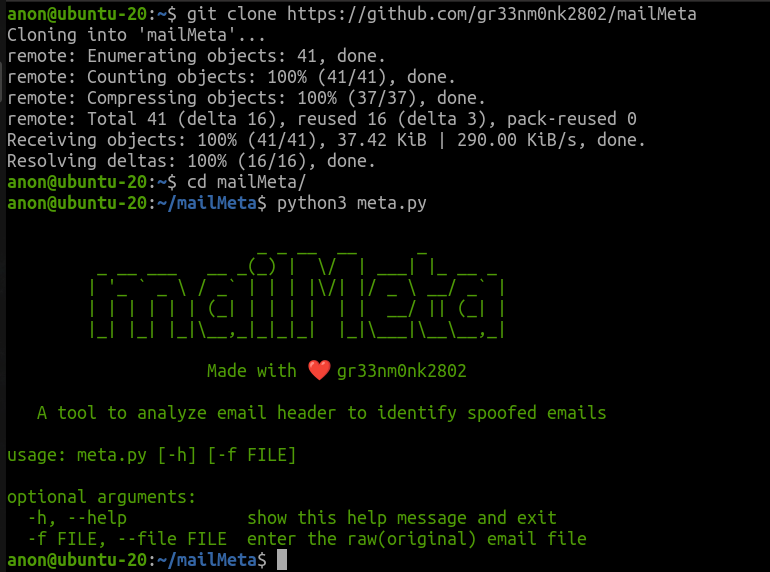
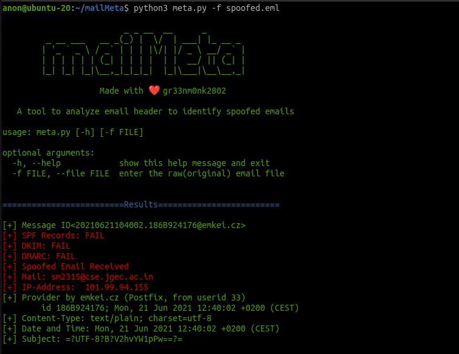
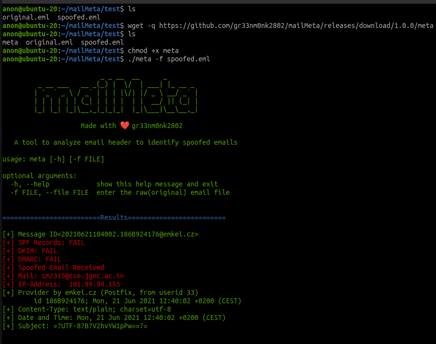
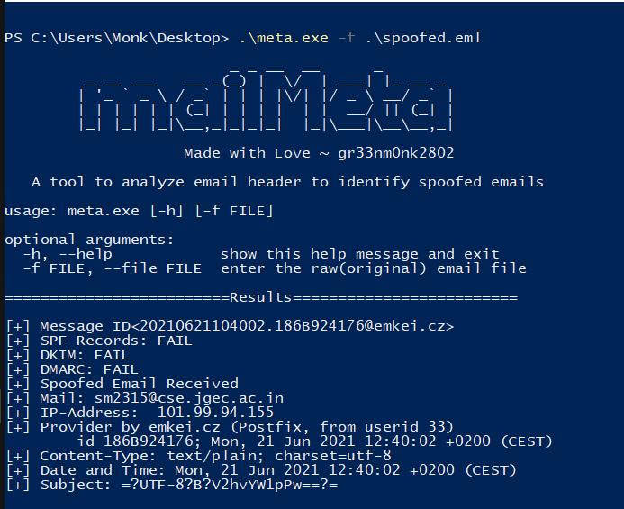
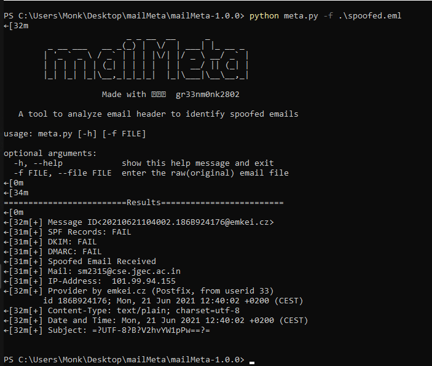

&nbsp;&nbsp;&nbsp;&nbsp;&nbsp;&nbsp;&nbsp;&nbsp;&nbsp;&nbsp;&nbsp;&nbsp;&nbsp;&nbsp;&nbsp;&nbsp;&nbsp;&nbsp;<br>
&nbsp;&nbsp;&nbsp;&nbsp;&nbsp;&nbsp;&nbsp;&nbsp;&nbsp;&nbsp;&nbsp;&nbsp;&nbsp;&nbsp;&nbsp;&nbsp;&nbsp;&nbsp;

[](https://shields.io/)
[](https://github.com/gr33nm0nk2802/mailMeta/blob/main/LICENSE)
[](https://shields.io/)
[](https://shields.io/)

<br>
&nbsp;&nbsp;&nbsp;&nbsp;&nbsp;&nbsp;&nbsp;&nbsp;A forensic tool to make analysis of email headers easy to aid in the quick discovery of the attacker. 


# Table of Contents
- [About mailMeta](#about-mailmeta)
- [Installation](#installation)
- [Usage](#usage)
  * [Linux](#linux)
  * [Windows](#windows)
- [Demo](#demo)
- [Contributions](#contributions)
- [Inspiration](#inspiration)
- [FAQ](#faq)
- [License](#license)

## About mailMeta

- What is mailMeta?

**mailMeta** is a python based forensic tool which reads through the email headers from the email file and extracts crucial information to identify if the email is legitimate. 

-  What are the advantages of using mailMeta?

Have you ever heared of **email hacking** or **sophisticated email crimes** where a spoofed email is sent to the victim and the victim trusts this email based on the email address which is infact fake. These email contains mallicious links which can be used to extract some information or install some malware or backdoors on your device. So, in order to avoid you from this mailMeta comes to your rescue.
  
 Here I have added instructions on how to download the email from the file and then pass it to the mailMeta executable. It then parses the headers and informs you if the mail is genuine or not. Whenever you are suspicious about an email be sure to check it once here. It can save you in most of the scenarios. If anyone has some ideas/updates feel free to open an issue or create a pull request.
 
 - What are the information revealed by the mailMeta?
mailMeta parses the following headers:
   
   * Message-ID 
   * SPF-Record
   * DKIM-Record
   * DMARC-Record
   * Spoofed Email detection based on the above headers
   * IP-Address of the sender
   * Service Provider used for sending the email
   * Content-Type
   * Data and Time 
   * Subject
 
 - Why is it important to check such parameters?
   * [ONGC Email Phising](https://indianexpress.com/article/business/companies/identity-theft-ongc-falls-prey-to-cyber-fraud-loses-rs-197-crore/)
   There are many more such cases which you can find online releated to email crimes.
 
## Installation

You have two methods to use metaMail. Either you can download the github repo and run the meta.py file from the command line. Make sure you have all requirements installed in this case like python3. You may also run the standalone binaries. This is for those who have very little technical knowledge.

<br>
1. Clone the repository

  ```(bash)
    git clone https://github.com/gr33nm0nk2802/mailMeta
  ```

2.  Running from the meta.py file

  ```(bash)
    cd mailMeta
    python3 meta.py
  ```
<br>



Additionally you can directly download the executable from the [Releases](https://github.com/gr33nm0nk2802/mailMeta/releases/tag/1.0.0) and use them.
<br>

## Usage
<br>

Either you are on windows or linux first download the original metadata of the email using the **show original** / **view raw** / **download original** option. 

Then we pass the `eml` file to the executable.
<br>

This is a demo of how to download the mail. You should find something similar.


### Linux

1. Use `meta.py` from the cloned repo. (Python is required)

```
python3 meta.py -f message.eml
```



or

2. Downloading the `meta` executable for linux and giving it executable permissions. Then supplying the eml file to the pre-compiled binary. (No dependencies)

```
wget https://github.com/gr33nm0nk2802/mailMeta/releases/download/1.0.0/meta
chmod +x meta
meta -f message.eml
```
<br>



### Windows

1. Executing the precompiled binaries downloaded from the releases page. (No dependencies needed)

```
meta.exe -f .\message.eml
```



<br>

or

2. Running from the repository clonned (Python Required)

```
python3 meta.py -f message.eml
```



## Demo

This is a sample demonstration explaining all the procedures. First it has the steps for running on linux then it has the steps needed for running on windows just in case you are struck.


## Contributions

Contributions and pull requests are highly encouraged for this project.

## Inspiration

This project has been made as a part of the GPCSSIP 2021 under the mentorship of [Rakshit Tandon](https://www.linkedin.com/in/rakshittandon/) sir to help aid in the detection of spoofed email and their tracking. 

## FAQ

What is the accuracy of this tool?
This tool simply reads the raw data of the mail downloaded.

## License

This project is licensed under the [MIT license](https://github.com/gr33nm0nk2802/mailMeta/blob/main/LICENSE).
